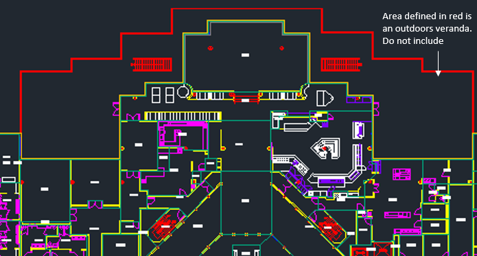

.. _svg_requirements:

============================
Facility Data Requirements
============================

The CITAM platform requires a Simplified Vector Graphic (SVG) representation of the facility drawing you wish to use as input. The model has simple but specific requirements for the SVG format. Although the platform can act upon SVG’s produced by free online converters there are expectations about the format of the initial drawing that must be met in order for this to work. Free converters typically produce unnecessarily bloated files, which can cause performance issues within the platform. The model performs most efficiently against a lightweight representation of the SVG.

This document will explain what a lightweight SVG will need to consist of - and what it doesn’t. We recognize that there are many drawing formats that can be the starting point for producing an SVG file. The focus of this process document will be to represent the most stripped down components required within the SVG file used by the model. It will also describe what information is required within the SVG in order for the model to best simulate real life scenarios.

The general idea is to relay a clear understanding of what the converted end point should look like, regardless of a users starting point,. We will leave it up to the end user to determine the best method to arrive at this format. Producing such a representation of your drawing will likely require some custom scripting. We will provide an example of what this would look like in the form of a VBA script that is designed to convert an AutoDesk DWG file to the desired simplified SVG format.
Scripting to accommodate other drawing sources are in consideration for future releases. We also welcome community contributions.

.. _svg_bare_essentials:

--------------------
SVG Bare Essentials
--------------------

There are several sections within the simplified SVG format that CITAM require.
Ancillary segments included in an SVG that are not represented below do not negatively impact the accuracy of the simulation, however they will be ignored by the model. It is, therefore, recommended to exclude them if possible.
Here is the breakdown of the required sections:

* SVG tag - identifies the facility and floor and defines the view box perimeter

    .. code-block:: xml

        <svg description='MyMap' id='SP-01' viewBox='-16325 -9000 22583 14101' xmlns='http://www.w3.org/2000/svg' xmlns:xlink="http://www.w3.org/1999/xlink">

* Style and Content Sections - used by the platform visualizers

    .. code-block:: xml

        
        <g id='Contents'> <!-- contents section -->
            <!--Group Elements -- see below -->
        </g>

* Group elements - used to indicate the different buildings, spaces and doors that the related path elements represent.

    .. code-block:: xml

        <g id='FacilityName' class='floorplan'>
            <g id='BUILDING-01'> <!-- ID of this building (this file supports multiple buildings as long as they are interconnected)  -->
                <g class="floors"> <!-- outline of the outside boundary of the floor -->
                    <!-- Path Elements <path .../> -->
                </g>
                <g class="spaces"> <!-- Boundary of all spaces in this floor -->
                    <!-- Path Elements <path .../> -->
                </g>
                <g class="doors"> <!-- Doors found in this floor -->
                    <!-- Path Elements <path .../> -->
                </g>
            </g>
            <g id='BUILDING-02'>
                <!-- contents similar to previous building -->
            </g>
        </g>

* Path elements - used to represent the polylines that define each of the spaces and doors.

    NOTE: each space path is required to have a unique id that is used throughout CITAM to tie them to related metadata.

    .. code-block:: xml

        <path id='SI_60985' d='M-3359.88 -2451.25 -3251.88 -2451.25 -3251.88 -2343.25 -3359.88 -2343.25Z'/>
        <path id='SI_61037' d='M-2700.69 -1699.25 -2623.44 -1699.25 -2623.44 -1778.25 -2700.69 -1778.25Z'/>
        <path id='SI_61036' d='M-2777.94 -1699.25 -2700.69 -1699.25 -2700.69 -1778.25 -2777.94 -1778.25Z'/>
        <path id='SI_61034' d='M-3066 -2683.81 -3000.97 -2618.78 -2925.84 -2693.94 -2935.78 -2703.84 -2937.53 -2702.09 -2992.62 -2757.19Z'/>
        <path id='SI_61033' d='M-3067.84 -2832.41 -3141.22 -2759.03 -3066 -2683.81 -2992.62 -2757.19Z'/>
        <path id='SI_61032' d='M-3211.22 -2689.03 -3136 -2613.81 -3066 -2683.81 -3141.22 -2759.03Z'/>

------------------------
Detailed Requirements
------------------------

Facilities
***********

* The source drawing must represent indoor spaces only. The platform is not designed to simulate transmission points in outdoor spaces - even outdoor spaces that are part of facility, such as...

* If the source facility is a large campus consisting of multiple connected buildings, the entirety of the campus must be represented (for a single floor, of course) across buildings within the SVG. This allows CITAM to appropriately handle traffic flow between buildings on that floor.
* If the source drawing represents a multi-floor building:

    * A separate drawing for each floor must be generated
    * Stairways and elevators must be included within the drawings so that model understands all the points within a facility that could serve as an entrance or exit for a floor. These should exist in separate layers within the drawing
    * Information in the SVG file should be grouped by building as shown in the :ref:`svg_bare_essentials` section above.

Groups
*******
All groups or subsections within a building section must be labeled with the following key words. All other subsections are ingnored.
* *spaces* - to represent stairways
* *doors* - represent elevators

Spaces
*******

* All inhabitable spaces within a source drawing must be defined by path elements
* The space defining polylines should exist within a separate and distinct layer or group in the SVG drawing file.
* Each path element defining a space will require an identifier that is unique across the drawing.
* The path element id must be embedded as an attribute of the path.
* The path element can include additional metadata as attributes or they can be provided in a separate CSV file along with other metadata. The unique ID is used to match spaces in the SVG and CSV files.
* The primary attributes are space type and space name:

    1. Space Types: can be one of the following:

        * Stairway or Stairs
        * Elevator
        * Office
        * Meeting Room
        * Laboratory
        * Restroom
        * Break room
        * Cafeteria
        * Hallway or Circulation

    2. Space Name: these can be completely custom labels used to reference a space by humans within a facility. Examples:

        * Arbitrary names such as: Chamber of Secrets, Jungle Room, etc.
        * Grid related identifiers unique to the facility such as:  *TF-B1-01-A1W06F*

Doors
******
* Doors are represented by their own path elements and grouped together under the "Doors" layer or section.
* Ideally, each space must contain at least one doorway or opening that indicates where a person would enter or leave a space.
* We realize that not all spaces, such as cubicals, have designated doorways assigned in drawings, therefore, the platform is designed to autonomously assign doorways to spaces that don’t include them. The assignment is made using two simple rules: (1) Find a wall for this space that is shared with a hallway and (2) Create a door at the end of the wall to represent the door. As you can image this will not work for all spaces, specially those that only share walls with other spaces that are not identified as hallways. In those cases, a manual update of the ingested floorplan is required to add doors to those spaces.

Below is a representation of the same space as the one shown in Fig. 1 with only the path elements required by CITAM.

.. image:: assets/example_floorplan_2.png
  :alt: Example floorplan.

Please note that CITAM was originally designed to identify potential transmission points within buildings associated with a manufacturing or research facilities. Your inputs in how to
make it more general for your types of facilities are welcome.

