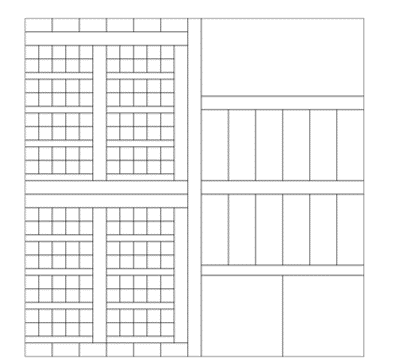
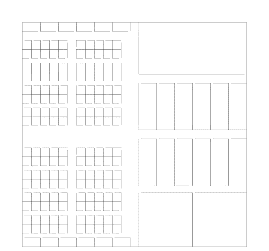

.. _tutorial:

=========
Tutorial
=========

**Contents**
    + `Introduction`_
    + `Adding a facility`_
    + `Generating the navigation network`_
    + `Running a simulation`_
    + `Exploring policies`_

Introduction
--------------

This is a brief tutorial on how to use CITAM.

CITAM is an agent-based modeling platform that can assist in the management of indoor facilities in the context of
airborne pandemics like COVID-19 and help make policy decisions to mitigate
indoor transmission risks.

This tutorial assumes that you have already downloaded and installed CITAM. For details
on how to install, visit the :ref:`getting_started` page. To verify
that CITAM has been installed properly, run the following command from your terminal:

.. code-block:: console

    $ citam -h

In the context of CITAM, individuals are referred to as "agents" (not the secret kind!).
Before you can run simulations, you must add your facilities to CITAM (a process
that we call ingestion). The ingestion process leads to a navigation-aware facility
in which agents can move in a realistic fashion.

Agents can be employees, visitors or any other users of your facility. To determine
how, when and where they move around in the facility, CITAM attempts to automatically
create a schedule and associated itinerary for them using scheduling and meeting policies that you can
provide. We will come back to those later in this tutorial. Let's start by
adding a facility.

Adding a facility
------------------

To add a facility, the most basic requirement is an SVG file that provides the spatial boundaries of
each space in "path" elements. CITAM also needs information about the function of
each space so it can build realistic schedules for the individuals who use them. Those information can be
provided in a companion CSV file where the "id" of each space is used to match them with the
SVG file.

For this tutorial, we will use example files provided with CITAM in the `examples/
directory <https://www.github.com/corning-incorporated/citam/examples/>`_. Please download those files from GitHub if you don't have them.

The example floorplan that we will use can be found in the **examples/basic_example_2**
folder located inside the main citam folder. The files that we need for now are named **TF2.csv** and **TF2.svg**
Fig. 1 shows how the floor plan given by TF2.svg looks like. You can use any SVG viewer to visualize it (any web browser will do).

Fig. 1: Layout of the floorplan used in this tutorial. Notice how the boundaries for each space are clearly shown.

Before ingestion, let's take a look at the content of TF2.svg. Use a text editor such
as `notepad++ <https://www.notepad-plus-plus.org>`_ to open the file and inspect its contents. Here is the top 30 lines of this file:

.. literalinclude:: assets/TF2.svg
    :language: xml
    :lines: 1-30
    :encoding: UTF-8
    :linenos:

If you are not familiar with SVG files, there is a brief tutorial in the `W3 Schools website <https://www.w3schools.com/graphics/svg_intro.asp>`_ to get you started.
The file contains a list of spaces with a geometric description of their boundaries in the "d" sub element.
Each space also has a (unique) ID used to identify them.

For a detailed discussion of the SVG format and the required information, please visit: :ref:`svg_requirements`

The second file of interest in TF2.csv. Let's take a closer look at it:

.. literalinclude:: assets/TF2.csv
    :language: csv
    :lines: 1-30
    :encoding: UTF-8
    :linenos:

As you can see, this file simply contains additional information about each space as identified by their ID.
For example, we can see that space ID "1" is an office on floor "0". For a list of supported values and
metadata please go to the :ref:`svg_requirements` page of the documentation. The ID field is read as a string. The only requirement is that it is unique. The space information provided in the CSV file can also be added to the SVG file (supported soon).

Now that we know what's in those two input files, let's ingest this floor plan using the ``citam engine ingest`` command as follow (from the
main citam directory):

.. code-block:: console

    $ citam engine ingest TF2 0 --csv examples/basic_examples/TFI.csv --map examples/basic_example/TFI.svg -v

`TF2` is the name of the facility under which this floorplan will be saved and `0` is the name of this floor. For all
subsequent operations on this facility, the same facility name must be provided. Alternatively, you may use:

.. code-block:: console

    $ citam engine ingest TF2 0 -csv examples/basic_examples/TFI.csv -svg examples/basic_example/TFI.svg -v

The ``-v`` argument is for verbose, to show more information as the ingestion process progresses.

After successful ingestion, you can export the ingested floorplans as an SVG file for inspection and validation.
This step is important because in the next step, you will build the navigation network (navnet) which can be a fairly expensive
process (it takes a few hours for large facilities) depending on the size of your facility. You definitely want to make sure the ingested facility looks good before building the navnet so
you don't have to repeat that step.
Let's export the ingested floorplan into a file named `TF2_ingested.svg`,
you can use the ``citam engine export-floorplan`` command as follow:

.. code-block:: console

    $ citam engine export-floorplan TF2 0 -o TF2_ingested.svg -v

Use any SVG viewer (such as your web browser) to visualize the exported file. Fig. 2 shows
what the ingested floor plan looks like. CITAM has removed walls that it thinks are unnecessary
(based on whether they fall between two hallways). CITAM has also added doors to each
space.

Fig. 2: The ingestion process will remove walls that are between hallways and add doors to all other spaces.

As you can see, the TF2 facility does not have an entrance and some valid walls have been mistakenly removed.
The good news, is that you can edit the SVG file to add the walls and doors that are missing. For that,
you will need an SVG editor such  `Inkscape <https://www.inkscape.com>`_ (free and open-source). These are the actions permitted:

1. Add a wall: To add a wall, you just need to draw a straight line where it should be.
2. Delete a wall: To delete an existing wall, simply delete the corresponding line in the drawing.
3. Modify a Wall: To modify a wall (make it shorter, or longer, or change its position), just manipulate the corresponding line in the drawing accordingly.
4. Add a door: To add a new door, you also need to draw a line where it should be, but you must assign an ID that contains the keyword "door" to it. Note that you can draw a door line an an existing wall line. CITAM will know to carve out the door from the wall.
5. Remove a door: To remove a door, you have to extend an existing wall or create a new wall to completely cover the door opening.

An example of the floor plan after using Inkscape to include wall features is as shown in Fig. 3.

.. image:: assets/FirstOutputFileEdited.png
  :alt: Edited floorplan.

Fig. 3: Floorplan as edited in Inkscape. The newly added lines are darker. Notice how a door is added to the left outside wall as a regular line except its ID is set to "dooor_1".

Save your edited svg file as "TF2_edited.svg". Now update it within CITAM using the citam engine update-floorplan
command as follow (assuming ):

.. code-block:: console

    $ citam engine update-floorplan TF2 0 -m ../../TF2_edited.svg -v

To verify that the floorplan looks good, you can export it again using the export-floorplan
command:

.. code-block:: console

    $ citam engine export-floorplan TF2 0 -o TF2_updated.svg -v

You can edit and re-update the floorplan as many times as needed until you are happy with it.

Congratulations! You have ingested your first floorplan. This is the most involved step in the process
but you only have to do it once for each floor of your facility. Once you are happy with the
floorplan, the next step is to generate the navigation network.

Generating the Navigation Network
------------------------------------

The navigation network (navnet) is what is used internally by citam to compute routes between
different locations in the facility. Use the following command to build the navnet for TF2:

.. code-block:: console

    $ citam engine build-navnet TF2 0

Please note that you only have to go through this process (ingestion and navnet
only once per facility per floor)

If you are curious, you can also export the navnet as an SVG file for visualization using the export-navnet command.

Once the navnet is created, you are good to go! Now you can run as many simulations
as you want for this floorplan.

Running a simulation
---------------------

To run a simulation, you need an input file in JSON format. Please
create a new folder to run the simulation. We will refer to this folder as
SIMULATION_FOLDER. Now open your favorite text editor and create a new file called
sim_inputs.json inside SIMULATION_FOLDER.

Below is an example input file.

::

    {
        "facility_name" : "TF2",
        "simulation_name" : "test_run_1",
        "floors" : ["0"],
        "entrances" : [ {"name":"AISLE213", "floor": 0}],
        "daylength" : 1800,
        "entrance_time" : 100,
        "n_agents" : 20,
        "occupancy_rate" : null,
        "floorplan_scale": 0.08333333333,
        "contact_distance": 6,
        "shifts": [{"name":"1", "start_time": 0, "percent_workforce": 1.0}]
    }

A detailed description of the input parameters can be found in :ref:`input_requirements`.

Copy and paste the contents above in your input file, then save and close the file.

Now navigate to your SIMULATION_FOLDER and start a new simulation using:

.. code-block:: console

    $ citam engine run sim_inputs.json

Sit back and relax as your simulation runs. Soon you will have results to analyze.

After less than one minute, the simulation should be completed and you should have
the following files created in your SIMULATION_FOLDER:

::

    SIMULATION_FOLDER
    ├── floor_0
    │   ├── contact_dist_per_coord.csv
    │   |── contacts.txt
    |   |── map.svg
    │   └── heatmap.svg
    ├── citam.log
    ├── contact_dist_per_agent.csv
    ├── employee_ids.txt
    ├── simulation.json
    ├── manifest.json
    ├── pair_contacts.csv
    |── raw_contact_data.ccd
    |── timing.txt
    └── trajectory.txt

Congratulations, you successfully ran your first simulation!

For a description of all the output files, go to: :ref:`outputs`

For details on how to visualize and interpret your results go to: :ref:`Visualize`

Exploring Policies
--------------------

Coming soon

To Learn More
---------------

.. toctree::
   :maxdepth: 2
   :glob:

   input_requirements
   facility_data_requirement
   outputs_description
   visualize_results