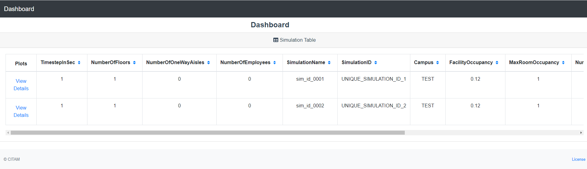
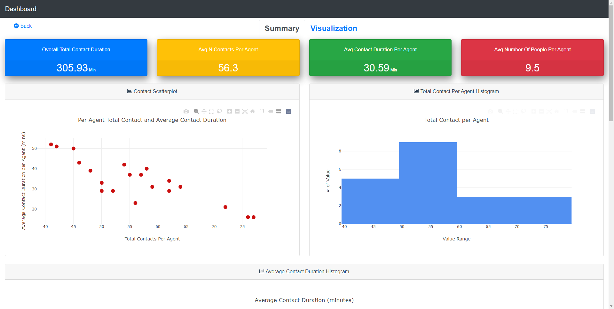
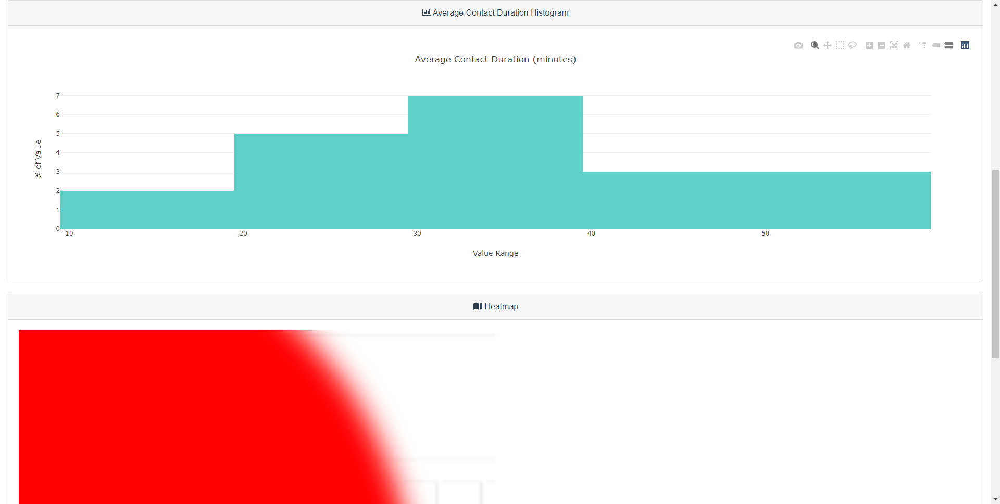
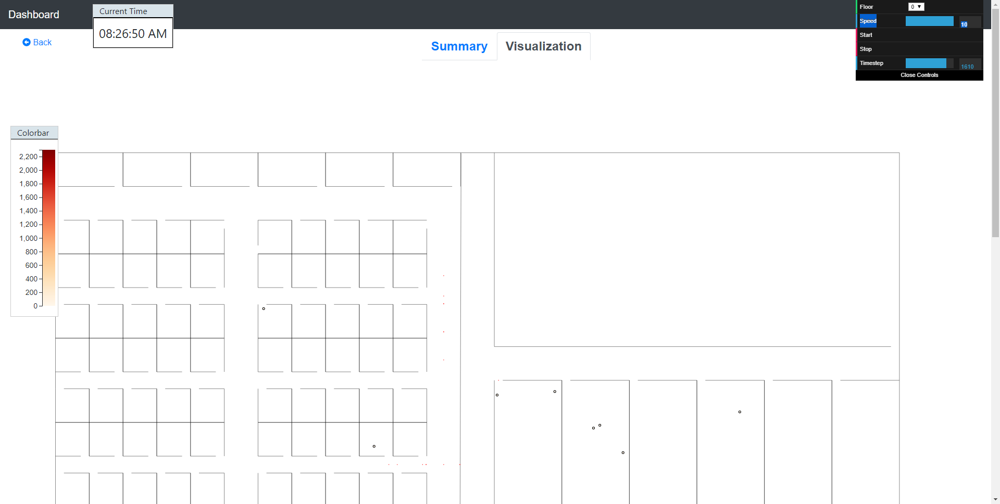

.. _visualize:

==================
Visualize Results
==================

Simulation results can be visualized using the dashboard. To start the dashboard:

.. code-block:: console

    $ citam dash

Please note that if the **CITAM_RESULT_PATH** environment variable is not set, the
--result option must be provided to use the dashboard.

To visualize more than 1 simulation result with the dashboard, set the **CITAM_RESULT_PATH**
as a parent directory from which all results subdirectories are accessible.

To set your environment varialbe, a quick web search should provide instructions
on how to dot it. For more customization options, please see the global configuration page.

----------------------
The Main Results Page
----------------------

The dashboard displays a list all of the simulations found in the specified results location
along with floor level information in tabular format. Th etable lists all the details extracted from
*manifest.josn* file.
To view data for a given simulation, click on *View Details*.

Details available on the main page:

.. table::
    :class: table-align

    +----------------------+
    | Column               |
    +======================+
    | TimestepInSec        |
    +----------------------+
    | NumberOfFloors       |
    +----------------------+
    | NumberOfOneWayAisles |
    +----------------------+
    | NumberOfEmployees    |
    +----------------------+
    | SimulationName       |
    +----------------------+
    | SimulationID         |
    +----------------------+
    | Campus               |
    +----------------------+
    | FacilityOccupancy    |
    +----------------------+
    | MaxRoomOccupancy     |
    +----------------------+
    | NumberOfShifts       |
    +----------------------+
    | NumberOfEntrances    |
    +----------------------+
    | NumberOfExits        |
    +----------------------+
    | EntranceScreening    |
    +----------------------+

These details can be controlled by *manifest.json* and *get_manifest* api.

|main_dash|

----------------------
The Details Page
----------------------

This details page has two tabs: Summary and Visualizer.

The Summary Tab
"""""""""""""""""""

The summary tab show key statistical information about the simulation results and
a few plots showing contact statistics.

Statistics cards comprise of following information:
 - Overall Total Contact Duration
 - Average Number of Contacts Per Agent
 - Average Contact Duration Per Agent
 - Average Number of People Per Agent

Charts are provided for:
 - Per Agent Total Contact and Average Contact Duration scatterplot
 - Total Contact per Agent histogram
 - Average Contact Duration (minutes) histogram

It also show a floorplan-based heatmap showing hotspot (where most contact events take place).

|summary_1|

|summary_2|

The Visualizer Tab
"""""""""""""""""""

The visualiation offers an interactive way to explore the time-dependent contact
data and trajectories of each agent. The page has a colorbar to denote agent contact intensity.
An agent with higher number of contact will be represented by intense red color.

|visual|

