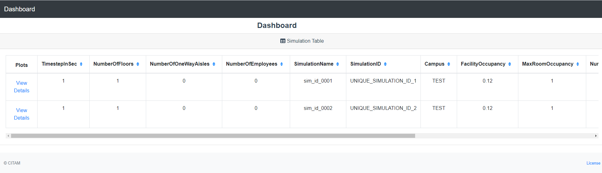
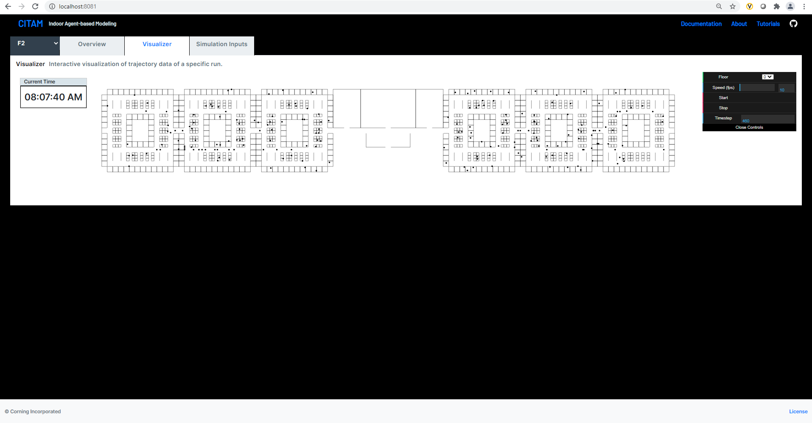

.. _visualize:

==================
Visualize Results
==================

Simulation results can be visualized using a basic GUI. 

..note::

    There are known issues with the GUI including speed issues when visualizing large trajectory files.

To start the dashboard:

.. code-block:: console

    $ citam dash

Please note that if the **CITAM_RESULT_PATH** environment variable is not set, the
--result option must be provided to use the dashboard.

.. code-block:: console

    $ citam dash --results .

To visualize more than 1 simulation result with the dashboard, set the **CITAM_RESULT_PATH**
as a parent directory from which all results subdirectories are accessible.

To set your environment variable, a quick web search should provide instructions
on how to do it on your machine. For more customization options, please see the global configuration page.

|main_dash|

The visualization offers an interactive way to explore the time-dependent contact
data and trajectories of each agent. The page has a colorbar to denote the number of contacts of each agent.
An agent with higher number of contact will be represented with a darker shade of red.

|visual|

